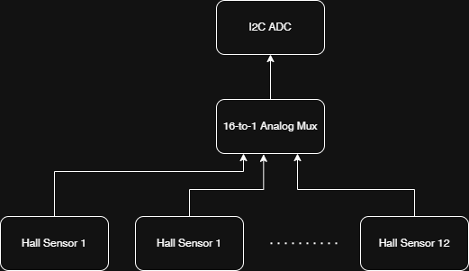
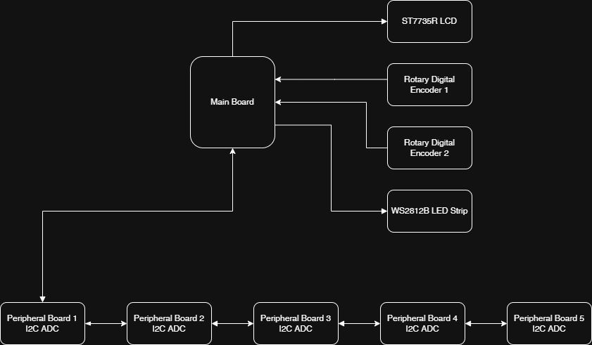
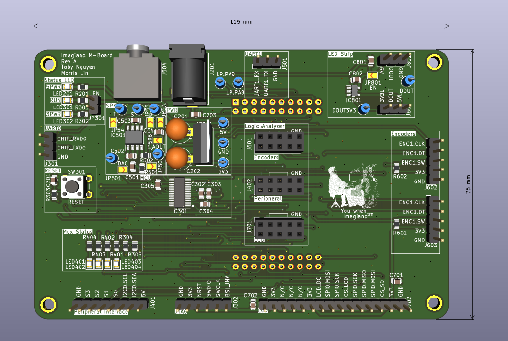
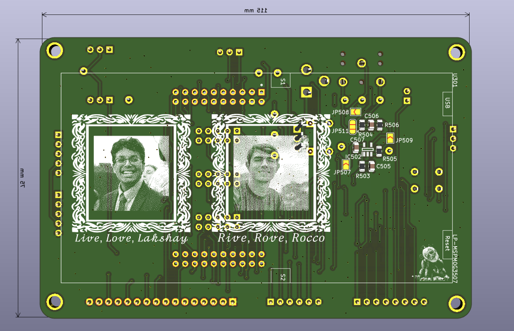
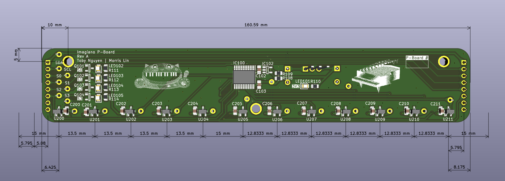
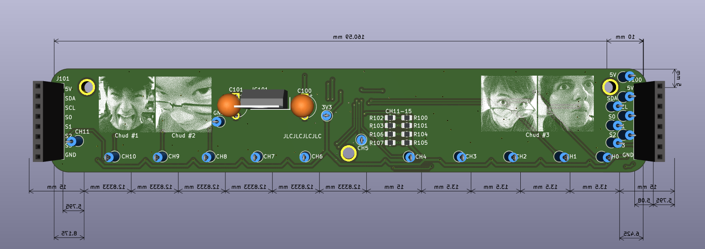

# Imagiano
Brought to you by
@jeffchang0
@MorrisYLin
@zaarabilal
@tguyenn

We decided to build a digital synthesizer/piano for our final project in UT Austin's Embedded Lab Class competition! We thought a piano was a great idea since we all love music, and a digital synthesizer presented a good deal of programming and electrical challenges.

TODO: insert picture of finished product? embed video
<!-- The most reliable method is to use the GitHub web interface to generate a hosted asset link: 
Edit your README.md on GitHub.com.
Drag and drop your video file (up to 100MB) directly into the editor pane.
Wait for the upload to complete; GitHub will automatically generate a specialized Markdown link (e.g., https://github.com...).
Preview and save your changes. The video will now appear as an inline player with sound controls.  -->

Our digital piano consists of    
1.) A main controller board  
2.) A series of peripheral boards  
3.) Piano keys with magnets  
4.) Piano enclosure  
... all from scratch!

# System Design
- figuring out requirements is the most important part of a project!
- figure out what the hell were doing
- somehow interface with a **LOT** of keys

## Electrical Design
- show schematic
- limitation to 2 layers due to budget constraints, also overkill for 4 layers since low speed signals

## Mechanical Design

TODO: @jeffchang0 cad models?

## system design challenges
- budget
    - through hole components
- mass manufacturing of keys
    - shoutout "tiw"

## implementation challenges (things we learned)
- jumpers!
- never trust anything. everything is a lie
    - pinout for onboard MSPM0 MCU was wrong on one rail, so we had to bluewire many pins

## Rev A 

## Rev A Credits
@jeffchang0 - Mechanical design    
@MorrisYLin - DAC Audio firmware, DSP firmware, PCB design    
@zaarabilal - I2C ADC driver, ST7735/KY-040 encoder drivers, Mechanical design    
@tguyenn - PCB design/assembly, WS2812B LED driver, Documentation    

# Rev B motivation and features
Due to time and budget restrictions, we decided to spin a new revision of the board to add some new features to the system.

Some of these features include:
- new dual core microcontroller to properly handle the math compute load, sound output, and user interface
- removed backpad devkit
- c

coming soon... ™️